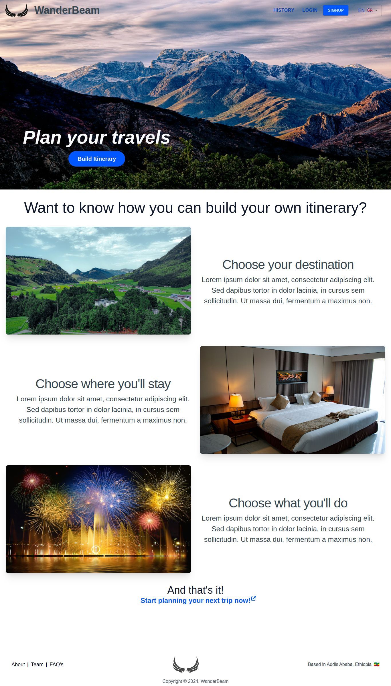
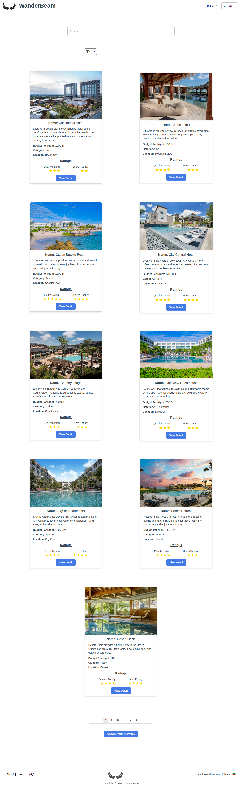
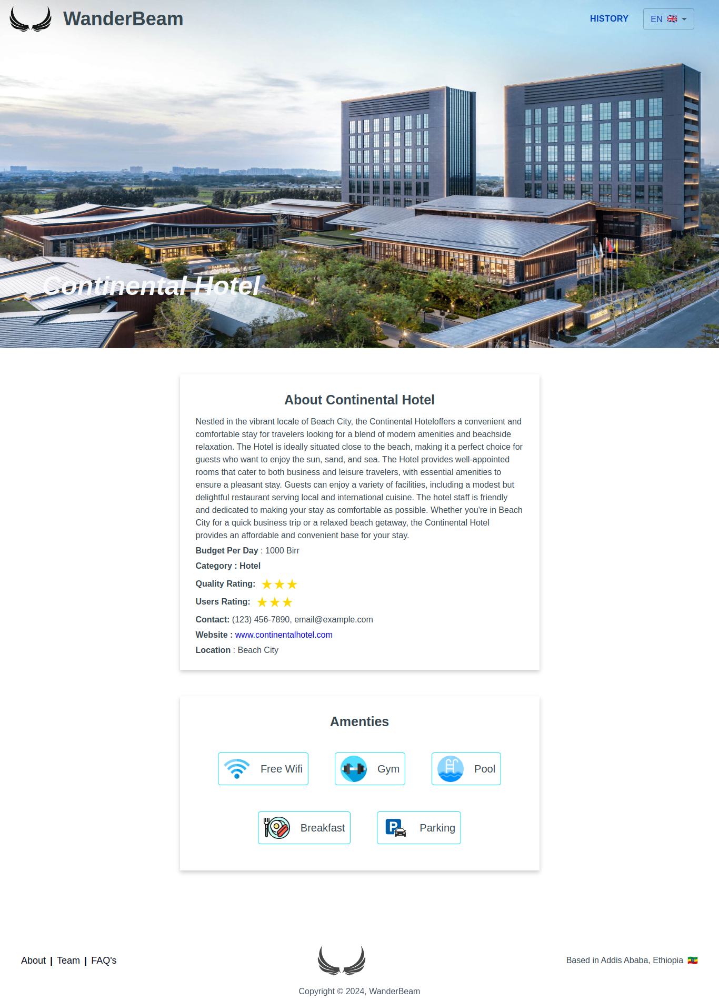
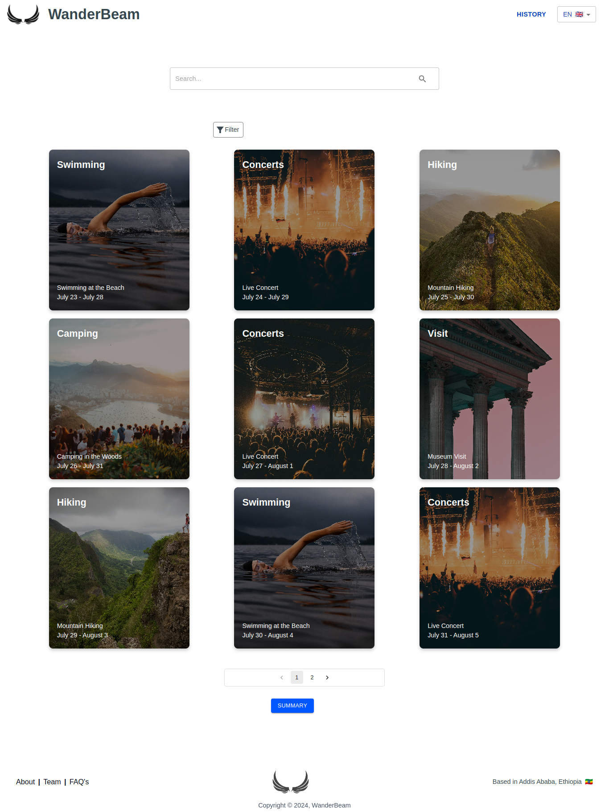
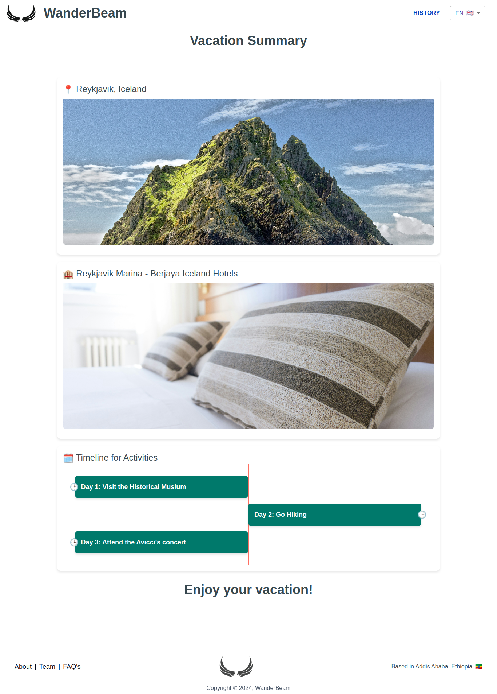

# Wanderbeam

Welcome to this project! This repository contains the code and resources for the project. Below are the details and screenshots of various pages included in the project.

## Home

The home page is the main entry point to the project.

## Places

The places page lists various places of interest.

## Lodging

The lodging page provides information about available lodging options.

## Lodging Detail

The lodging detail page gives detailed information about specific lodging options.

## Activities

The activities page lists various activities that can be done.

## Summary

The summary page provides a summary of the itinerary built by the user.

Thank you for exploring the project! For more details, please refer to the documentation or contact the project maintainers.
